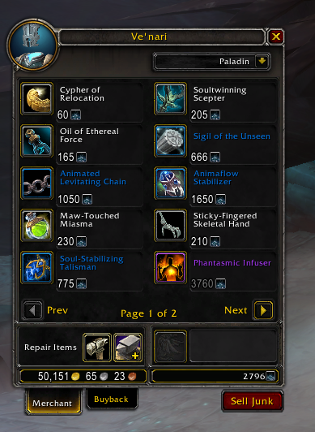

# FigSellJunk

A World of Warcraft addon that adds an extra button to the vendor window that when clicked, vendors all available junk / poor quality / gray items in your inventory.

## Screenshots

**Added "Sell Junk" button**

**Simple report in chat log after selling junk items**

**The button is hidden on the "Buyback" tab**

